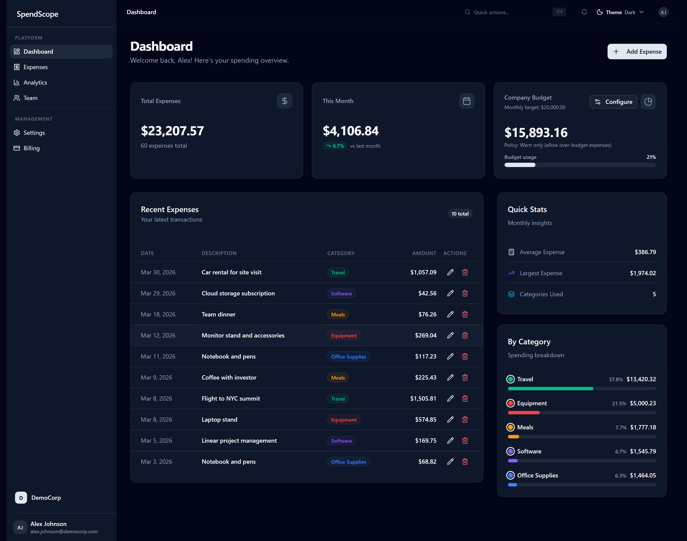
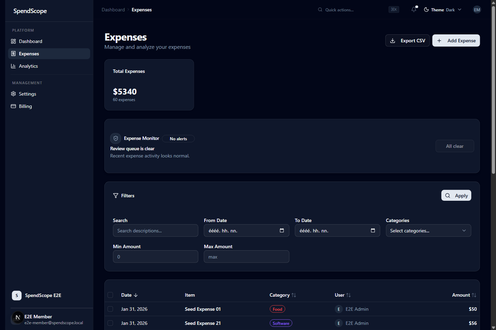
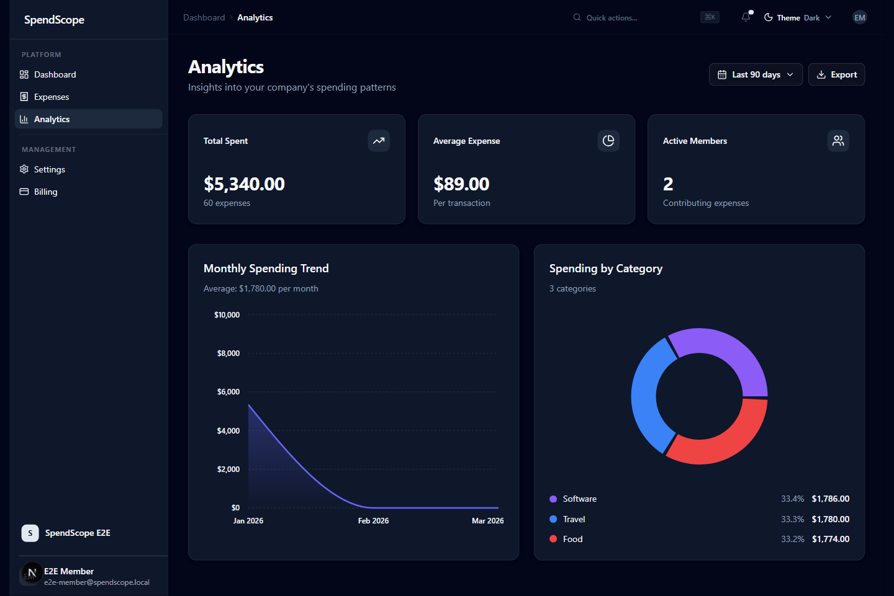

# SpendScope

SpendScope is a product-minded expense operations platform for finance and ops teams that need to see where team spend is going, keep billing flows reliable, and avoid policy drift as companies grow. It was built as a production-grade portfolio project, not a landing-page-only SaaS mockup.

## Live Product

- Live demo: [https://v0-spend-scope.vercel.app/](https://v0-spend-scope.vercel.app/)
- Portfolio case study: [docs/portfolio/case-study.md](docs/portfolio/case-study.md)
- Portfolio copy pack: [docs/portfolio/project-copy.md](docs/portfolio/project-copy.md)

The deployed product is the primary proof surface for this project. This repository is the implementation deep dive for architecture, quality gates, and engineering decisions.

## Review This Project

Recommended evaluator path on the live deployment:

1. Open [https://v0-spend-scope.vercel.app/signup](https://v0-spend-scope.vercel.app/signup) and authenticate with Google or GitHub.
2. Complete workspace onboarding or enter the seeded review workspace if the deployed environment is already prepared for demos.
3. Review `/dashboard` for top-level spend visibility and summary cards.
4. Review `/dashboard/expenses` for filters, table interactions, CSV export, and expense monitoring.
5. Review `/dashboard/analytics` for trend and category insight quality.
6. Review `/dashboard/team` and `/dashboard/billing` for role-aware management and billing behavior.

## What This Project Demonstrates

- Multi-tenant company isolation with server-side tenant resolution
- Role-aware workflows across dashboard, expenses, analytics, team, and billing
- Policy-conscious expense management with filtering, sorting, CSV export, and optimistic updates
- Stripe checkout, billing portal, and webhook synchronization with idempotency controls
- Deterministic demo seeding, Jest coverage, Playwright flows, and strict TypeScript quality gates

## Product Story

The core use case is a small team that has outgrown ad hoc expense tracking. Finance and ops leads need one place to:

- understand current spend quickly
- review category trends and team activity
- control who can manage billing
- keep dashboard data and billing state trustworthy after mutations

SpendScope focuses on that operational surface area instead of trying to be a generic accounting suite.

## Visual Walkthrough

### Dashboard overview



### Expense operations



### Analytics surface



## Reviewer Flow

For local review or recorded walkthroughs, use deterministic demo data:

```bash
npm run seed:demo:reset
npm run seed:demo -- --seed=20260309 --reference-date=2026-03-01
```

Suggested review path:

1. Sign in and land on `/dashboard` for the top-level spend summary.
2. Open `/dashboard/expenses` to review filters, table interactions, and expense monitoring.
3. Open `/dashboard/analytics` to inspect trend and category breakdowns.
4. Open `/dashboard/team` and `/dashboard/billing` to verify role-aware management behavior.

Expected seeded state:

- Company: `SpendScope E2E`
- Authenticated review account: `E2E Member` in the seeded `SpendScope E2E` workspace
- Team size: 2 seeded members in the shared demo company
- Categories: 3 active categories represented across seeded data
- Expenses: 60 deterministic expenses across a fixed multi-month window
- Subscription state: billing surfaces enabled in the seeded review environment

## Architecture Highlights

### Auth and tenant safety

- NextAuth v5 handles authentication with Prisma persistence.
- Tenant context is resolved on the server from database state, not from stale token assumptions alone.
- Privileged actions enforce membership and role checks server-side.

### Data consistency

- Dashboard and analytics reads are cache-tagged by tenant scope.
- Expense and category mutations explicitly invalidate affected dashboard and analytics tags.
- Team and expenses routes now surface explicit failure states instead of silently degrading into empty data.

### Billing hardening

- Stripe webhooks are signature-verified and idempotent through persisted event handling.
- Billing actions are admin-gated.
- Billing routes emit request-scoped logs for easier incident review.

System context diagram: [`public/architecture/system-context.svg`](public/architecture/system-context.svg)

## Performance And Quality Evidence

Latest captured dashboard benchmark on the deterministic seeded workspace:

- First dashboard load median: `360ms`
- Warm dashboard load median: `271ms`
- Largest dashboard data request median: `49ms` first load / `50ms` warm

These numbers were captured from the authenticated seeded `SpendScope E2E` review workspace documented above. Full protocol, raw run notes, and the local host caveat: [`docs/benchmarks/dashboard.md`](docs/benchmarks/dashboard.md)

Merge-readiness checks used in this repo:

- `npx tsc --noEmit`
- `npm run lint`
- `npm test -- --runInBand`
- `npm run build`

## Tech Stack

- Next.js 16 App Router
- React 19
- TypeScript with `strict: true`
- Prisma + PostgreSQL
- NextAuth v5
- Tailwind CSS 4 + shadcn/ui
- Jest + ts-jest
- Playwright
- Stripe
- Sentry and Upstash Redis as optional production integrations

## Run Locally

1. Install dependencies:

```bash
npm ci
```

2. Create local environment config:

```bash
cp .env.example .env.local
```

3. Generate the Prisma client and apply migrations:

```bash
npx prisma generate
npx prisma migrate dev
```

4. Seed the deterministic demo workspace:

```bash
npm run seed:demo:reset
npm run seed:demo -- --seed=20260309 --reference-date=2026-03-01
```

5. Start the app:

```bash
npm run dev
```

Open [http://localhost:3000](http://localhost:3000).

## Environment Notes

Use `.env.example` as the source of truth. The most important local variables are:

- `DATABASE_URL`
- `NEXTAUTH_SECRET`
- `NEXTAUTH_URL`
- `APP_URL`
- OAuth provider credentials for Google and GitHub

If billing is enabled, also configure the Stripe variables listed in `.env.example`.

## Tradeoffs And Next Steps

What I optimized for here:

- correctness and role-aware server boundaries over client-only convenience
- deterministic demo and test flows over purely cosmetic mock data
- practical production concerns such as cache invalidation, webhook idempotency, and error-state honesty

What I would do next at larger scale:

- move selected dashboard aggregates behind scheduled materialized views
- add queue-backed webhook fanout and retry orchestration
- instrument p95 latency and error budgets for dashboard and billing routes
- add a stronger spend-policy exception and approval workflow as the next differentiating product feature

## Project Docs

- [ARCHITECTURE.md](ARCHITECTURE.md)
- [docs/benchmarks/dashboard.md](docs/benchmarks/dashboard.md)
- [docs/deployment/test-mode-checklist.md](docs/deployment/test-mode-checklist.md)
- [docs/deployment/manual-regression-checklist.md](docs/deployment/manual-regression-checklist.md)
- [docs/portfolio/case-study.md](docs/portfolio/case-study.md)
- [docs/portfolio/project-copy.md](docs/portfolio/project-copy.md)
- [docs/deployment/rollback-runbook.md](docs/deployment/rollback-runbook.md)
- [SECURITY.md](SECURITY.md)

## License

MIT. See [LICENSE](LICENSE).
